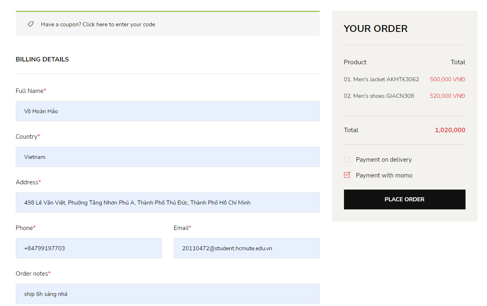

 <h1 align="center">Clothing E Commerce Website</h1>

# Introduction

Here is my java source code for Clothing E Commerce Website. with my code, you could: 
* **Login and Logout**
* **Payment**
* **View personal information**
* **View order history**
* **View all purchased products**
# Experiments
## 1. Sign up, Sign in & Forgot password
The login function:

* **Allows users to log in to the system.**
* **Users enter their full information => Click [Sign In].**
  USER
 
  ADMIN
 
The register function:

* **Allows users to register for an account.**
* **Users enter their full information => Click [Register].**
 

The function of the forgot password page:

Allows users to reset their forgotten password.
* **Step 1: Enter username and perform verification.**
* **Step 2: After the system verifies that the entered account exists, the system will send a confirmation code to the registered email of that account. After receiving the code, the user needs to enter the correct code into the input box and click on the button to reset the password.**
 

## 2. Home

PAGE HOME USER

 
 
PAGE HOME ADMIN 

## 3. Products

The function of the shop page:

* **Allows users to view product information.**
* **Add products to the shopping cart.**
* **Paginate products.**
* **Search and paginate products.**
* **Filter products by category and paginate them accordingly.**

 

* **View details of the product such as: images, price, description...**
* **Add the product to the shopping cart.**
* **Related products.**

 

## 4. Profile Account

* **Displays the user's personal information such as name, email, profile picture, phone number, etc.**
* **Allows users to change their displayed personal information and change their password.**

PROFILE USER

 
 
PROFILE ADMIN

 

 ## 5. History

 The function of the order history page:

* **Displays information about the user's purchase history.**
* **Allows users to view the detailed information of each order.**

 

  ## 6. Shopping Cart & Payments

* **Displays the products added to the cart.**
* **Allows users to remove unwanted products from the cart.**
* **Updates the quantity of products in the cart => Click "Update Cart".**
* **Proceeds to purchase the products => Click "Proceed to Checkout".**

 SHOPPING CART
 

 CHECK OUT
 

 INVOICE
 

 PAYMENTS BY MOMO
 

 # ⭐ Future Features

-   Pending

_Feel free to fork and contribute to include these features._ ❤︎

# 🚀 Technologies

 Programming tools and languages used:
  -   Database management system: MySQL.
  -   Programming tools: Spring Tool Suite 4, Visual Studio Code, Eclipse.
  -   Programming language: Java.
    
 Supported libraries and frameworks:
  -   Spring Boot, Spring Data JPA, Thymeleaf, Lombok, and some other libraries

# 🤝 Contribute

To contribute, fork the repository and push the changes to the **master** branch. Then submit a pull request for merging with the source. If your code passes the review and checks it will be merged into the master branch.

# 💬 Feedback

Feel free to send us feedback on [gmail]. Feature requests are always welcome.

# 📝 License

Licensed under the [MIT License].
  
